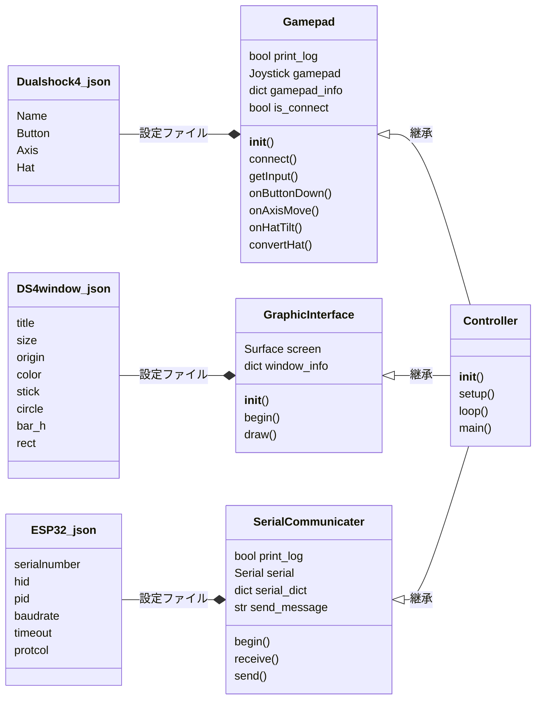
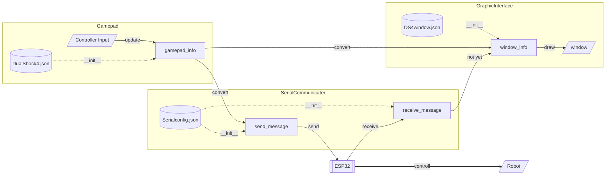

# raspi-controller
Raspberry Piに接続したゲームコントローラーからESP32とシリアル通信してロボットを動かしたい  

# 構成
```text
raspi-controller/
├─ src/
│  ├─ config/                   # 設定ファイルフォルダ
│  │  ├─ DualShock4.json        # PS4コントローラー用
│  │  ├─ DualShock4_raspi.json  # PS4コントローラー用(ラズパイ版)
│  │  ├─ ElecomPad.json         # なんかあったエレコムのコントローラー用
│  │  ├─ ESP32.json             # ESP32との通信用(未使用)
│  │  └─ DS4window.json         # 画面描画用
│  ├─ ESP32_EchoTest/
│  │  └─ ESP32_EchoTest.ino     # シリアル通信のテストコード
│  ├─ requirements.txt          # ライブラリ一覧
│  ├─ main.py                   # メインプログラム(半完成)
│  ├─ test_checkcontroller.py   # コントローラー入力→画面描画のテストコード
│  ├─ checkButtons.py.          # コントローラーのボタン割り当てを確認するプログラム
│  ├─ GamepadInput.py           # コントローラーの入力受付用
│  ├─ checkButtons.py           # コントローラーのボタン割り当て確認用
│  ├─ GraphicalInterface.py     # コントローラー入力確認画面の描画用
│  └─ SerialCommunication.py    # マイコンとの通信用
├─ LICENSE                      # これでいいのかわかってない
└─ README.md                    # 説明用の文書
```
 今のところコントローラー入力の取得、画面の描画、シリアル通信をそれぞれGamepadInput.py,GraphicInterface.py,SerialCommunication.pyで行い、main.pyでそれを統合する予定。  
 各プログラムにはその機能を担うクラスと、単体テストを行うためのmain関数がある。main.pyは3つのクラスを継承したControllerクラスを作ってmainメソッドを呼べば動くようにする予定。test_checkcontroller.pyではこのうちシリアル通信機能を省いたものを結合テストその1として作成した(PCにて動作確認済み)。  
 configフォルダ内のjsonファイルはコントローラーのボタン割り当てや画面の構成、通信関連の設定とかを保存しておいて、読み込むファイルを変えることで実行環境への依存度が減ったらいいな...ってやつ。  
 ラズパイで動かしてみたところ、どうもコントローラーのボタンの割り当てとかがPCとやや異なるようで、別のjsonファイルを作って互換性をつけた。  
　通信も特に問題なかった(python,ESPともにループの中でポーリングするようにしてるが、実行速度差を考えると非同期処理を使った方が良さそう)

 ↓見れない人用 [クラス図](img\classDiagram.jpeg) ・ [フローチャート](img\flowchart.png)



 ---
 最終更新:2026-05-08